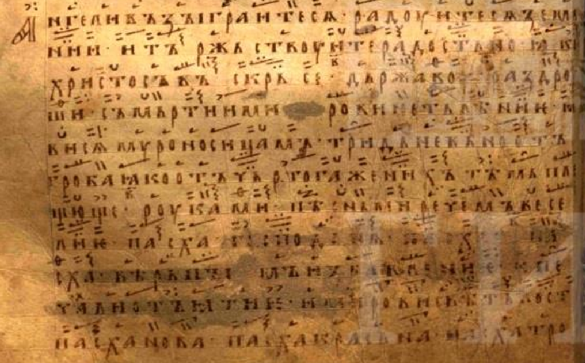

# Во святую и великую неделю Пасхи

### Стихиры на Хвалите

**В неделю на *Хвалите Господа с небес* стихиры, глас 1:**

<*Пелись в неделю, понедельник, вторник и субботу*>

<*Разворот 63, вкладки на разворотах 64 и 65*>

Днесь спасение миру елико видимыи и елико невидимыи, Христос из мертвыих воскреснет, 
Христос в себе приидет, Христос от гроба свободится, от уз греховныих; врата адова отверзаются 
и смерть раздрушается, и ветхыи Адам изводится и новый совершается, яже о Христе новая тварь 
обновися; Пасха, Господня Пасха, и пакы реку: Пасха, честь Троица; се нам праздником праздник, 
се торжество есть торжеством: вътъбо Христос воскресе из мертвыих, просвещая во тьме и 
в сени и спасая сыны земленыих, яко Благ и Человеколюбец. 

Воскресения день, плод сотворим себе, честь здание и своиственое, отдадим Образу еже 
и по образу, познаим наше достоинство, почтим древле образное, разумеим таинства силу, 
и за кыих Христос умре, да нас умерщвеныя возведет к животу, яко Благ и Человеколюбец. 

Светлаго и славнаго празднества воскресения образ приимше, Господня учениця си апостолом 
благовествоваху глаголюще: уже не крыитеся, но проповедаите Спаса нашего тридневное воскресение, 
ада бо испроверже и нам дарова неиследное и живот, и воскресение, яко Благ и Человеколюбец.

**На целовании, глас 8-й:**

Ангели взыгратеся, радуитеся земнии и торжествуите радостно, яко Христос воскресе, державу 
раздруши смерти, и мирови нетление, явися мироносицам тридневено от гроба, яко от Чертога 
Жених; тем плещюще руками песньми речем веселие: Пасха, Господня `[...]` Пасха верным 
`[...]` печали отъятие и мирови светлость; Пасха нова, Пасха красна, Пасха Троична честь 
и Божественая слава. 
<*см. [Вложение-1]()*>

---
##### Вложение-1

