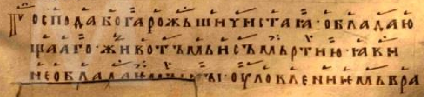

# В среду 5 недели трипесна

<*p. 142*>

**Глас 4**

#### Песнь 3. Ирмос: *Не мудростию*

Взыде Христе на Крест, к жизни возводя мя. Прободеся в ребра, бесмертие подавая ми, 
верно хвалящиим Ти благостыню. 

Да воставиши в гробех спящая, Бесмертне, во мертвыих вменися причастник, и воскресе 
третий день, яко Всемогай. 

Мертва видевше Тя, живот мертвым Подавающа, мироносица тощно помазатъ течааху 
плачуще, воскресша же слышавше радоваахуся.

*Богородичен:* Иже естеством Своим Сый невидим, видим бысть плотию ис Тебе, Непорочная 
Госпоже, и распятие и смерть волею пострадав. 

#### Песнь 8. Ирмос: *Распятаго плотию*

Распятие волею пострадав Христе и вменися в мертвыих, воскресе третий день 
бесмертие дая земным разумевающая силу Твою. 

Что с мертвыими ищете Живодавца Бога, воскресе якоже рече, мироносицам женам 
ангел явлиися светел. 

Явися учеником востав, и во мнозех днех с ними ядый, и посылааше в конци земля 
проповедати слово. 

*Богородичен:* Господа Бога рожши, Чистая, обладающааго животом и смертию, 
яви необладаимы `[`  ны?   `]` уловлением вражия льсти.    

---
*Примечание:*

#### Песнь 9. Ирмос: *Рож(де)ство Ти*

Вознесеся плотию на древо, в рове положися проеисподлним, и воскресе во славе, 
совоскресив с Собою весь мир; тем согласно Добродетеля Тя хвалами возвеличим. 

Кропящиим слезы яко миро, ангел рече мироносицам: что Живааго во гробе ищете 
с мертвыми, се востал есть, разрушив адовы немощи яко Человеколюбец. 

Видевше Христа воскресша, святии апостоли божественно и радости исполнишася, 
во многы дни ядуще с Ним и научени бывше лучшиим спасением. 

*Богородичен:* Яко двере светлу, от ада видевши Солнце восиявше праведное, 
Девице, и просветивша конца всего мира, и исполнися божественыя печали, Непорочная.    

