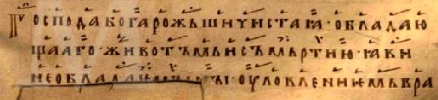

# В среду 5 недели трипесна

<*p. 142*>

**Глас 4**

1. Воскр. перг. 27 (ГИМ 80370/269) — л.139 об.-140 об.
2. ГИМ Син.896 — л.76 об.-77 об.
3. РГАДА, Ф. 381. Оп. 1. Ед. хр. 137 («Триодь Моисея Киянина») — л.222-223
4. РГАДА, Ф. 381. Оп. 1. Ед. хр. 138 — л.124-125

#### Песнь 3. Ирмос: *Не мудростию*

Взыде, Христе (3: \Слове), на Крест, к жизни возводя мя. Прободе ся (4:\си) (1,2: +в) ребра, бесмертие (3: +ми) 
подавая (4: \подая) ми, верно хвалящиим (3: \поющим) Ти благостыню.

Да въставиши въ гробех (4: \гробе) спящая, Бесмертне, во мертвыих вменися причетник, (1,2: +и) 
воскресе третий день, яко Всемогай. 

(3:\ Да въставиши въ гробех спящая, Бесмертне, вменися въ мртвыихъ истлению не применися 
Причастник, и воскресе третий день, яко Всемогый)

Мертва видевше (3: \видевша) Тя, живот мертвым Подавающа (4: \Подающа), мироносица тъщно помазатъ течааху 
плачуще (3: \плачющеся), (3: +и) воскресша (1,2,4:+же) слышавше (3: \слышаху и)
(4: \слышавша) радоваахуся.

*Богородичен:* Иже естеством Своим Сый невидим, (3: +и) видим (4: \виден) бысть (3: \бывает) 
плотию ис Тебе, Непорочная Госпоже, и распятие и смерть волею пострадав (3: \притрьпе). 

#### Песнь 8. Ирмос: *Распятаго плотию*

Распятие волею пострадавъ (4: \пострада), Христе, и въменися въ мертвыихъ, въскресе третий дьнь, 
бесъмертие дая земьнымъ, разумевающая (4: \разумевающа) силу Твою. 

(3:\ Распятие и волю Христе притрьпе, и въменися въ мьртвыхъ, въскрьсе третий (днь),
бесъмьртьствуя земьныя, разумевающе силу Твою)

Чьто съ мьртвыими ищете Живодавьца (3: +и) Бога, (3: +и) въскрьсе якоже рече, муроносицамъ женамъ 
ангелъ (3: \бесплътьный) явлиися (3: \явлься) светьлъ (3: \светьлый). 

Явися ученикомъ въставъ, (1,2,4: +и) въ мънозехъ дьньхъ съ ними (2: \нимь) ядый, (1,2,4: +и) 
посылааше (3: \посълавъша) въ коньци (3: \конца) земля проповедати слово. 

*Богородичен:* Господа Бога рожьши (4: \рожъшия), Чистая (4: Чиста), обладающааго животъмь 
и съмьртию, яви (3: \яве) необладаимы `[`  ны?   <*см. [Вложение-1]()*> `]` 
(2,4: необладаемъ(ы) ны) (3: \обладаемы) уловлениемь (4: \улавляемъ) вражия (3: \вражиемь +и) 
льсти (3: \льстию).    

#### Песнь 9. Ирмос: *Рож(де)ство Ти нетьленьно*

Възнесеся плътию на древо, въ рове положися преисподьнимь, (1,4: +и) въскрьсе въ славе, 
съвъскресивъ съ Собою вьсь миръ; темь (4: \темже) съгласьно Добродетеля (3: Добродетели)
(4: добродетелию) Тя (1,2,4: хвалами възвеличимъ) (3: хвалим). 

Кропящиимъ сльзы яко муро, ангелъ рече муроносицамъ: чьто (1,2,4: +Живааго) въ гробе
(3,4: +съ мртвыими) ищете (1,2: +съ мьртвыими), (1,2: +се) въсталъ есть, раздрушивъ (3: \рушивъ) адовы 
немощи яко Чловеколюбець.

Видевъше (4: \Видевши) Христа (4: \Христе) въскрьсъша (3: \въставъша) (3,4: +Тя) (3: +(Хе)), 
святии апостоли божьствьно (1,2,4: +и) радости (3: +ся) испълнишася (3: \исплъниша), въ мъногы 
дни ядуще (4: \ядущу) съ Нимь (4: \ними), и научени (1,2: бывъше лучьшиимь спасениемь) 
(3: быша съ Нимъ бывъшимь (спсени)) (4: бывъше учиша спсениемь). 

*Богородичен:* Яко двьрь светьлу, отъ ада видевъши (4: видевъше) Сълньце въсиявъше правьдьное, 
Девице, и просветивъша (4: просветивъшаго) коньца всего мира, (1,2: +и) испълнися
(1,2: +божьствьныя) печали, Непорочьная.

(3: Яко двьрь светьлу, отъ ада въсиявъше (Слнце) видевъше правьдьное,
(Двице), и просветивъшю коньца вьсего мира, бжствьныя испълнися радости, Непорочьная)

---
##### Вложение-1

